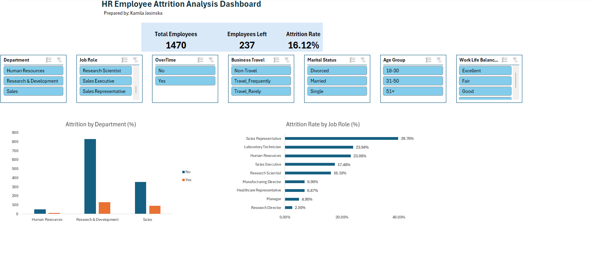
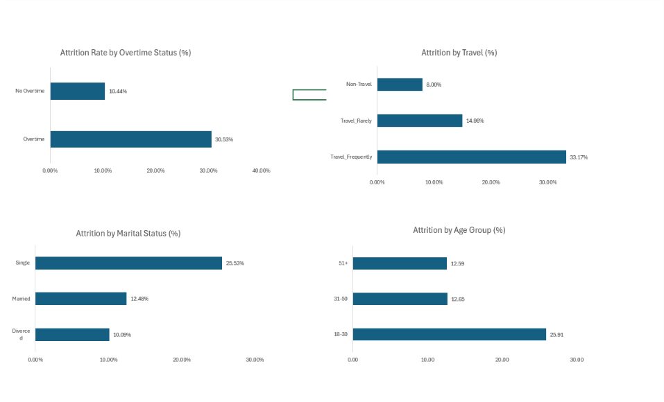
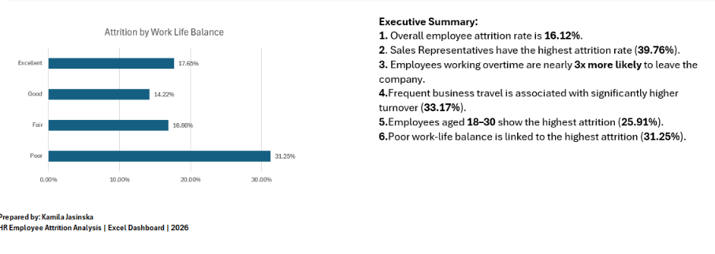
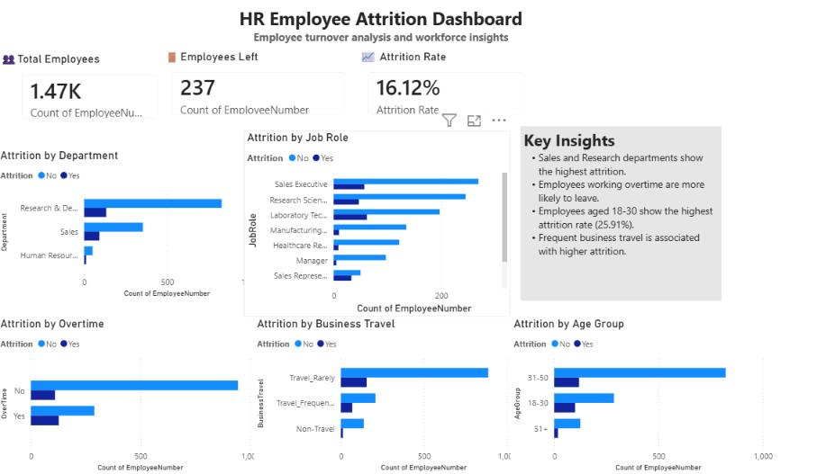

# HR_Employee_Attrition_Analysis
HR Analytics project using Excel, SQL and Power BI

# Project Overview

This project analyses employee attrition using HR data.

The project was completed using:
- Excel
- SQL
- Power BI

The goal was to identify the main factors influencing employee turnover and present the results in interactive dashboards.

---

# Tools Used

- Microsoft Excel
- SQL
- Power BI

---

# Dashboard KPIs

- Total Employees
- Employees Left
- Attrition Rate

---

# Key Findings

- Overall attrition rate: 16.12%
- Sales department has the highest attrition.
- Sales Representatives have the highest employee turnover.
- Employees working overtime are much more likely to leave.
- Employees aged 18–30 have the highest attrition.
- Frequent business travel is associated with higher employee turnover.

---

# Files Included

- HR_Employees_Analysis.xlsx
- Power_BI_HR_Analysis.pbix
- Dashboard screenshots

---

# Author

Kamila Jasinska

## Dashboard Screenshots

### Excel Dashboard

### Power BI Dashboard

